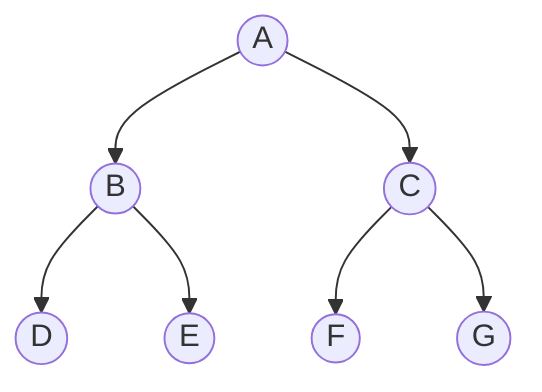
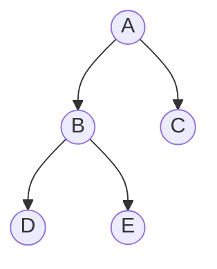
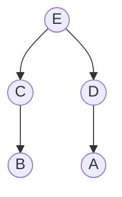
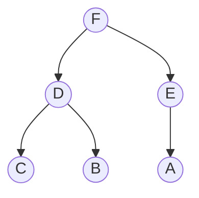

程序9.3：自底向上堆化（`fixUp`方法）

程序9.4：自顶向下堆化（`fixDown`方法）

程序9.5：基于堆的优先队列

**满二叉树**：除最后一层无任何子节点外，每一层上的所有结点都有两个子结点的二叉树。

**完全二叉树**：一棵深度为k的有n个结点的二叉树，对树中的结点按从上至下、从左到右的顺序进行编号，如果编号为i（1≤i≤n）的结点与满二叉树中编号为i的结点在二叉树中的位置相同，则这棵二叉树称为完全二叉树。

**堆有序**：如果一棵树中，每个节点都大于或等于所有子节点，则称树是堆有序的。(下图是堆有序的，但不是完全二叉树)

**堆**：是一个节点的集合，表示为数组，其中关键字按照堆有序的完全二叉树的形式排列。

**堆化**：把一棵不是堆的树转化成堆。